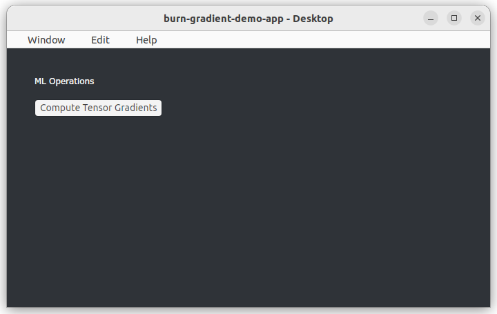

# burn-gradient-demo-app

Lightweight desktop tensor gradient demo built with Dioxus, Burn, and Ractor.



## Dependencies

- dioxus
- ractor
- burn

## Reproduce

```sh
# Desktop app (Ubuntu)
dx serve
dx serve --platform desktop
```

## License

MIT

